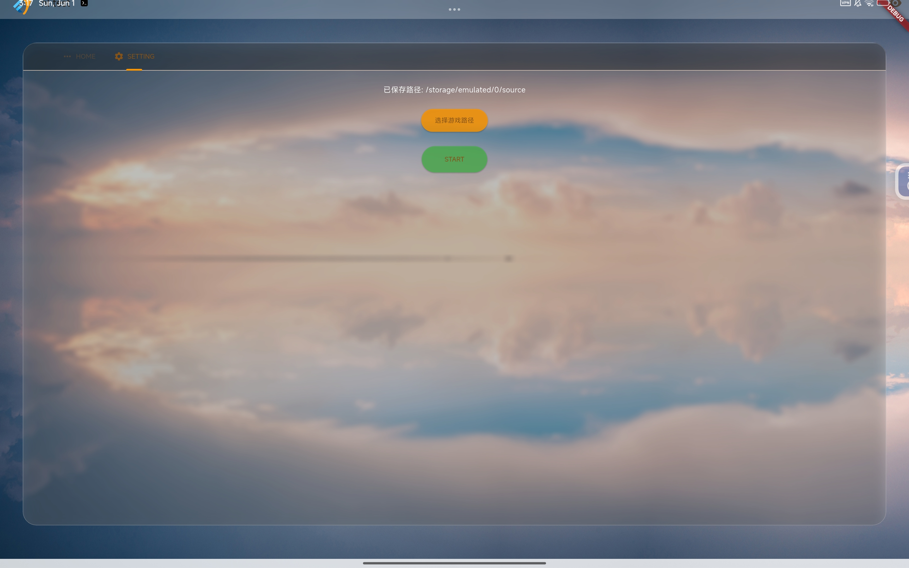
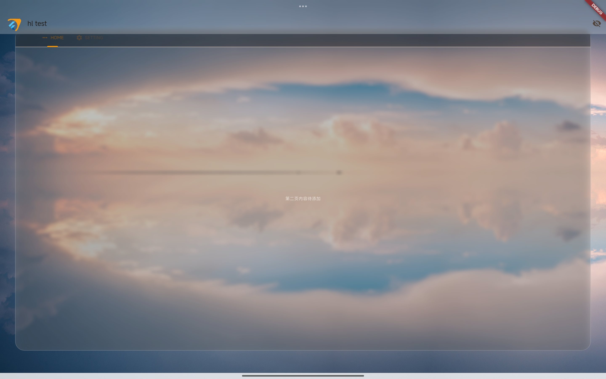

# 🚀 SourceEngine 启动器  
- flutter-srceng-app

---

  
  

> **Flutter 跨平台游戏启动器** · 专注于高效与可扩展性  

---

### ✨ 核心功能  
- **跨平台支持**：基于 Flutter 构建，兼容 Android/iOS/Windows/Linux  
- **轻量高效**：原生性能优化，低资源占用  
- **模块化设计**：支持功能插件扩展  

---

### 🔮 未来开发计划  
- [ ] **LogView 模块**  
  - 实时游戏日志监控  
  - 关键词高亮与过滤  
- [ ] **TouchEditView 交互**  
  - 可视化触控布局编辑器  
  - 手势自定义映射  
- [ ] **输入系统重构**  
  - 弃用 `nillerusr/sdl_touch` 方案  
  - 改用 touch pad （#实验性的 #java #kotlin 实现）
- [ ] **稳定性提升**  
  - 修复多线程资源竞争问题  
  - 优化 Vulkan/OpenGL 上下文切换  
#更多功能待开发  
  
---

# Screenshots

---

### 🛠️ how to build 
# android-studio || vscode 
- 直接打开项目配置就行

# Termux 终端构建完整教程  
> 基于 flutter aarch64 开发包 和 ndk r27b
---

- 需要准备一个 termux #linux aarch64_x64_x86 终端仿真器
- 需要 flutter ndk 社区 aarch64 的版本 x64_x86的设备直接跑proot x86_64 下载开发工具就行了
--- 到这一步 x64_x86 设备可以不用看了

- 按照流程配置工具 打开项目就行了

